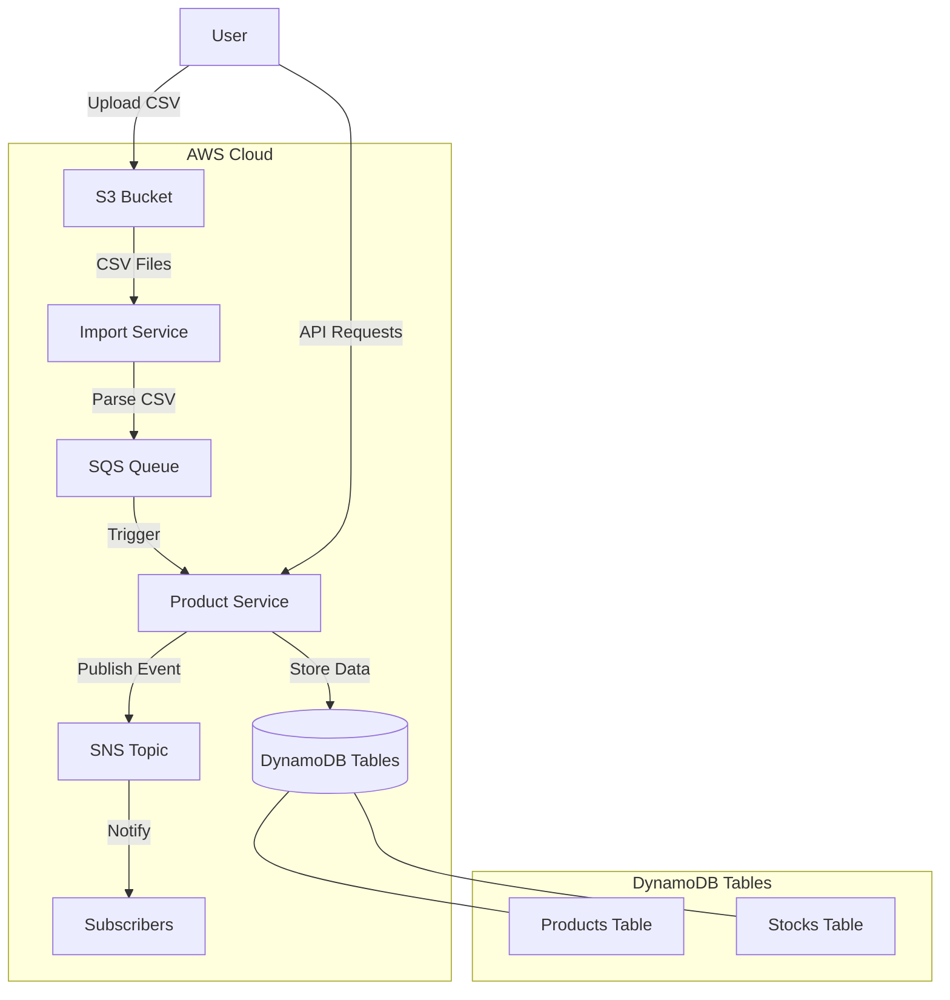

# AWS Services Flow Diagram

## Flow Description

1. User uploads CSV files with product data to S3 bucket
2. Import Service processes the CSV files
3. Parsed product data is sent to SQS queue
4. Product Service is triggered by SQS events
5. Product Service creates new products in DynamoDB (Products and Stocks tables)
6. Product Service publishes notifications to SNS topic
7. Subscribers receive notifications about new products

This diagram represents the serverless architecture implemented in this project, showing the integration between various AWS services for product data processing.